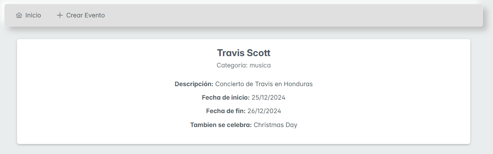
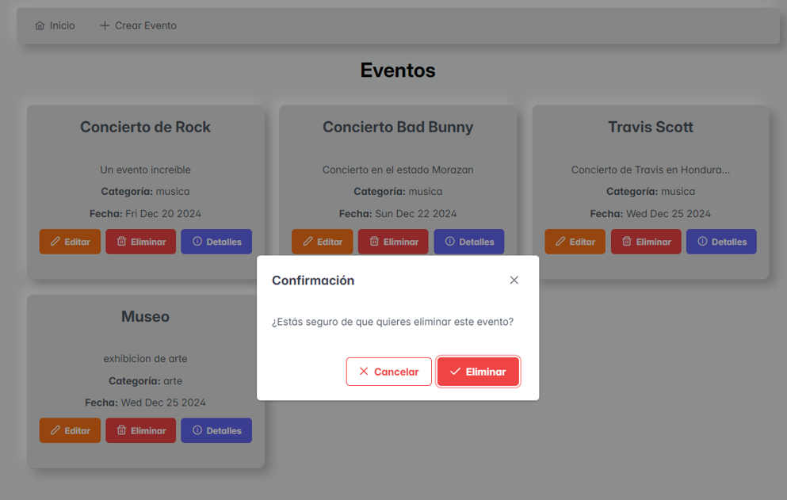
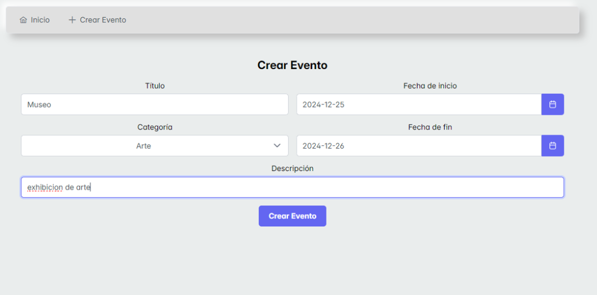

App de eventos

Este repositorio contiene una aplicación de gestión de eventos con una base de datos no relacional en MongoDB, con backend en Ruby y un frontend en React. La aplicación permite crear, visualizar, actualizar y eliminar eventos, y se integra con una API externa para obtener si en esa fecha hay alguna festividad usando la api de calendarific.

## Explicación de las decisiones de diseño, elección de tecnologías y metodologías utilizadas. 

- Diseño: simple y minimalista con un diseño responsivo centrado en la funcionalidad para los usuarios complementado con prime react.

- Tecnologias: tomando en cuenta que se necesita la creacion de una API RESTful se escogio ruby on rails por su facilidad de creacion de aplicacion en este caso API y testeada en postman, en cuanto al frontend react es una excelente opcion para aplicaciones web rapidas y eficientes que hacen la experiencia de usuario mas agradable por sus tiempos de carga, finalmente la base de datos en mongodb ideal para manejar unicamente eventos.

- Metodoligias: Desarrollo basado en componentes, arquitectura RESTful, y patron de diseño de servicios separando la logica de negocio.
## Instrucciones para configurar y ejecutar la aplicación

### 1. Requisitos previos

- Node.js y npm
- Ruby y Rails
- mongoDB

### 2. Configuracion del Backend

levanta el servidor de mongodb y navega al directorio de la api e instala las dependencias
```
bundle install
```

luego configura la base de datos
```
rails db:create 
rails db:migrate
```

inicia el servidor backend
```
rails server

```


### 3. Configuracion del Frontend

navega al directorio frontend e instala las dependencias
```
npm install
```

inicia el servidor
```
npm run dev
```


### 4. Uso de la aplicación
crear un evento


visualizar todos los eventos, y modal para eliminar


ver detalles de un evento
